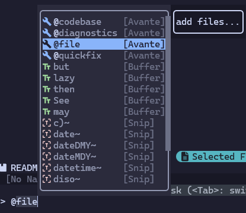
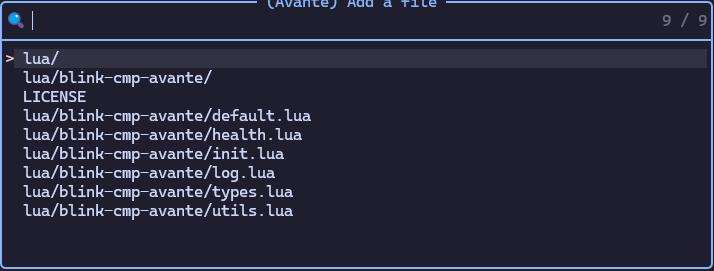
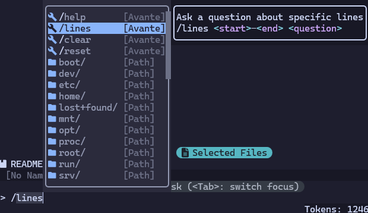

# blink-cmp-avante

Avante source for [blink.cmp](https://github.com/Saghen/blink.cmp)

Use `@` to trigger the mention completion:



Accept the `@file` or `@quickfix` will open the selector for the file or quickfix list:



Use `/` to trigger the command completion:



## Installation

Add the plugin to your packer managers, and make sure it is loaded before `blink.cmp`.

### `lazy.nvim`

```lua
{
    'saghen/blink.cmp',
    dependencies = {
        'Kaiser-Yang/blink-cmp-avante',
        -- ... Other dependencies
    },
    opts = {
        sources = {
            -- Add 'avante' to the list
            default = { 'avante', 'lsp', 'path', 'luasnip', 'buffer' },
            providers = {
                avante = {
                    module = 'blink-cmp-avante',
                    name = 'Avante',
                    opts = {
                        -- options for blink-cmp-avante
                    }
                }
            },
        }
    }
}
```

## Default Configuration

See [default.lua](./lua/blink-cmp-avante/default.lua).

## Q&A

### How to customize the highlight

Customize the `BlinkCmpKindAvante` to customize the highlight for kind icon, here is an example:

```lua
vim.api.nvim_set_hl(0, 'BlinkCmpKindAvante', { default = false, fg = '#89b4fa' })
```

## Version Introduction

The release versions are something like `major.minor.patch`. When one of these numbers is increased:

* `patch`: bugs are fixed or docs are added. This will not break the compatibility.
* `minor`: compatible features are added. This may cause some configurations `deprecated`, but
not break the compatibility.
* `major`: incompatible features are added. All the `deprecated` configurations will be removed.
This will break the compatibility.

## Acknowledgment

Nice and fast completion plugin: [blink.cmp](https://github.com/Saghen/blink.cmp).
